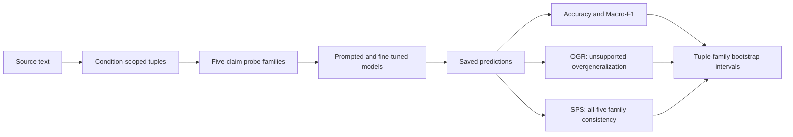

# CondRelBench

### A mixed-domain benchmark for condition-scoped relation understanding

[](https://doi.org/10.6084/m9.figshare.32948507)
[](LICENSE_DATA.md)
[](https://www.python.org/)

Models often recognize that two things are related. The harder question is whether
they preserve **the condition under which that relation holds**.

> If a paragraph supports “A affects B **when C is true**,” does a model know that
> removing, replacing, or contradicting C changes what the paragraph licenses?

CondRelBench turns that question into a reproducible benchmark across synthetic
text, biomedical abstracts, and Reddit narratives. It pairs condition-scoped tuple
extraction with five-claim probe families that test whether a model understands the
whole relation—not just familiar words or a plausible direction of effect.

## The benchmark at a glance

| | Released artifact |
|---|---:|
| Domains | 3 — Synthetic, PubMed, Reddit |
| Canonical probe rows | 52,112 |
| Tuple families | 10,449 |
| Saved model predictions | 401,906 |
| Reported runs | 47 |
| Bootstrap repetitions per run | 10,000 |

Every intended tuple family contains five related claims:

| Probe | What changes? | Expected judgment |
|---|---|---|
| P1 | The relation is contradicted | Not Supported |
| P2 | The condition is replaced | Not Enough Evidence |
| P3 | The condition is removed | Not Enough Evidence |
| P4 | The original condition-scoped relation is preserved | Supported |
| P5 | The condition is contradicted | Not Supported |

This family structure exposes a failure that row-level accuracy can hide. For
example, the prompted Llama run on the synthetic domain reaches **74.3% accuracy**,
but only **23.0%** of complete families have all five judgments correct. CondRelBench
therefore reports both ordinary classification metrics and family-level consistency.

## From source text to evidence



The repository supports two complementary tasks:

1. **Tuple extraction** — recover the relation, its arguments, and the condition
   that scopes it.
2. **Probe classification** — decide whether each claim is supported, contradicted,
   or left unresolved by its paragraph.

The included cross-domain runs also show what survives when a model learns from one
kind of language and is tested on another.

## Reproduce the evaluation

Evaluation is designed to run without downloading model weights or repeating
inference. With Python 3.10+:

```bash
python -m pip install -r environments/evaluation-requirements.txt
python src/validation/validate_release.py
python src/validation/validate_splits.py
python src/evaluation/bootstrap_tuple_families.py \
  --manifest manifests/run_manifest.csv \
  --output results/bootstrap_recomputed.csv \
  --metadata-output results/bootstrap_recomputed_metadata.json \
  --repetitions 10000 \
  --seed 20260802
```

The reference output is
[`results/bootstrap_all_reported_runs.csv`](results/bootstrap_all_reported_runs.csv).
Bootstrap sampling is performed by `Tuple_ID`, keeping all five related probes
together.

## Explore the release

| Path | What it contains |
|---|---|
| [`data/extraction/`](data/extraction/) | Gold condition-scoped tuples |
| [`data/probes/`](data/probes/) | Canonical P1–P5 claims and labels |
| [`data/splits/`](data/splits/) | Released train/validation/test partitions |
| [`predictions/`](predictions/) | Compact predictions for all 47 runs |
| [`results/`](results/) | Estimates and 95% bootstrap intervals |
| [`manifests/`](manifests/) | Run mapping, model settings, and family completeness |
| [`src/evaluation/`](src/evaluation/) | Extraction, probe, OGR, SPS, and bootstrap evaluation |
| [`src/training/`](src/training/) | Recovered training and inference programs |
| [`src/validation/`](src/validation/) | Integrity, checksum, and split-leakage checks |
| [`docs/`](docs/) | Methods, data dictionary, rules, scope, and limitations |
| [`provenance/`](provenance/) | Retained source-review and historical materials |

Good starting points are the
[`data dictionary`](docs/data_dictionary.md),
[`probe construction protocol`](docs/probe_construction.md), and
[`evaluation metrics`](docs/evaluation_metrics.md).

## Reproducibility, without pretending

The saved predictions are sufficient to recalculate the reported metrics and
confidence intervals. Training and inference scripts preserve model identifiers,
prompts, seeds, and recorded hyperparameters.

The original runs did **not** retain immutable upstream model revisions or complete
package lockfiles, so bit-for-bit historical retraining is not promised. The release
also discloses 107 recovered tuple families with missing probe rows and retains 2,611
blank or noncanonical predictions as evaluation errors instead of silently repairing
them. See [`docs/reproducibility_scope.md`](docs/reproducibility_scope.md) for the
full boundary of what can and cannot be reconstructed.

## Integrity and provenance

- `CHECKSUMS.sha256` covers every released file.
- Split validators check disjoint tuple and source groupings.
- `manifests/run_manifest.csv` maps every reported run to its prediction artifact.
- Historical exploratory materials are isolated under `provenance/legacy/` and are
  not presented as the authoritative benchmark-construction pipeline.

After intentionally changing release files, regenerate and verify checksums:

```bash
python src/validation/build_checksums.py
python src/validation/validate_release.py
```

## Citation and license

Please cite **CondRelBench: A Mixed-Domain Benchmark for Condition-Scoped Relation
Understanding** and the [Figshare dataset](https://doi.org/10.6084/m9.figshare.32948507).
See [`CITATION.md`](CITATION.md) for the current citation record.

The dataset is distributed under
[CC BY 4.0](https://creativecommons.org/licenses/by/4.0/). A source-code license was
not recorded in the archived project and has therefore not been invented here.
Third-party source terms may still apply to derived PubMed and Reddit text; see
[`LICENSE_DATA.md`](LICENSE_DATA.md) and [`RELEASE_CHECKLIST.md`](RELEASE_CHECKLIST.md).
